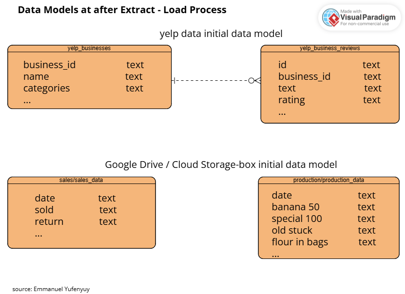
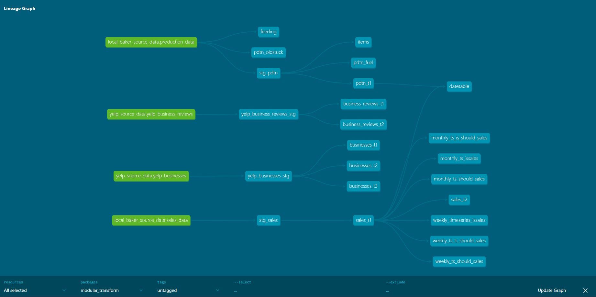
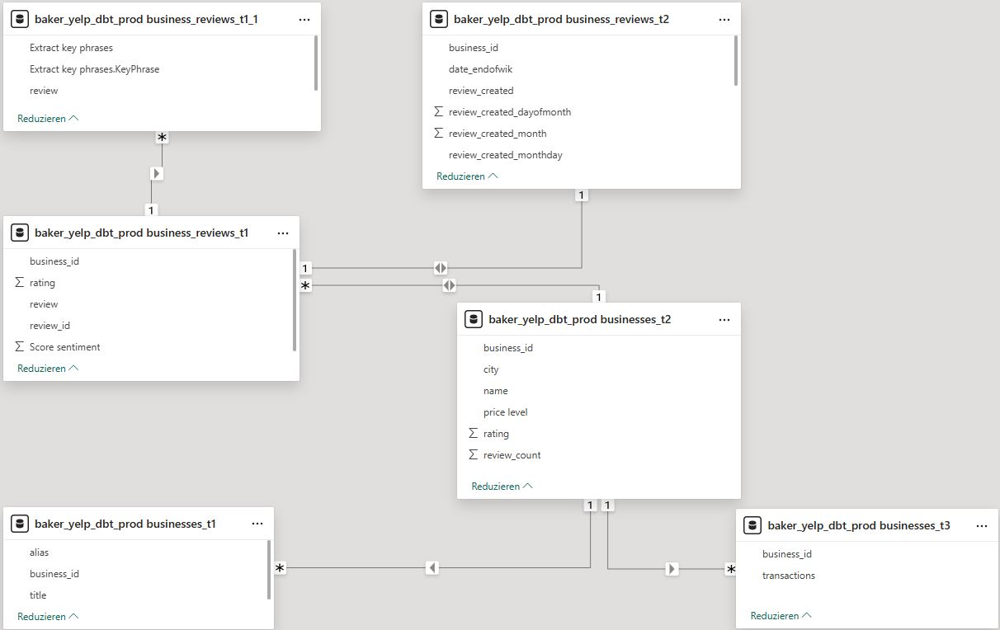

<link rel="stylesheet" href="background.css">
<h1>

<b>Data Transform Process</b>

</h1>

Data transformation is part of the data integration principles and is the most complex phase in both Extract-Transform-Load and
Extract-Load-Transform architectures or frameworks. As already stated in the <a href = "https://github.com/yufeenyuy/extract_load">extract_load</a> repository, data transformation is composed of four components, namely: <em>filtering, harmonization ,aggregation and enrichment</em>. In the Extract-Transform phase a few data transformation activities were employed already. Example: JSON data from the Yelp fusion API was converted into relations/tables which is a schema expected by relational database management systems like PostgreSQL. When the data was loaded in PostgreSQL, a basic data model was created by default as can be seen on the following image.

<a href="https://docs.getdbt.com/docs/get-started-dbt">getdbt</a> is a data transformation platform that allow developers to <em>develop, test, deploy, and explore data products using SQL, in particular Data Query Language(DQL)</em>. Data transformation in getdbt follows a <b>read-write</b> approach which allows developers to transform data in models. Models in this context are simple Data Query Statements. The data transformations for this project can be found in the <b>models</b> folder. One major advantage of getdbt is that developers don't have to bother about Data Defination Language and Data Manipulation Language as this is handled by the platform. Transforming data in form of models allow developers to break the transformation process into the lowest granularity level possible, which creates transparency in the transformation process. Additionally, the transformation follows a Directed Acyclic Graph(DAG) which can be visualized to understand dependencies between the transformation steps. In this project,<a href="https://docs.getdbt.com/docs/core/installation-overview">dbt-core</a> with PostgreSQL adapter is used. Before installing dbt-core(e.g via pip in python), it is recommended to have installed the target database which is supported by dbt. In this project the target database is PostgreSQL.

During the data transformation process of the Yelp and Local Bakery Datasets, a series of transformation steps were applied which include:
+ Identification and removal of rows with unexpected dates e.g 1900-01-28 00:00:00.
+ Replacement of 'None' and 'NaN' values with Null.
+ Exemption of columns that are not relevant for analysis from the transformation process.
+ Setting the right data types for the columns required for analysis: e.g date, numeric etc.
+ creating new tables via dbt models and their relationships to other models to achieve a data model that is suitable for analysis.
+ Included test cases to ensure correctness and consistency of the models.

On the image below, you can find the find the generated DAG from the transformations done with dbt-postgres.

In power BI addtional transformation was done to prepare the data for analysis. Specifically, the *sentiment score and key phrases* were calculated and extracted respectively from the review text. As a result, an extra table was created based on the tables that were imported from the database. Thus, the resulting data model that is used to analyse Yelp Business reviews is shown on the following image. The tables on the model can be seen on the lineage DAG displayed above.

